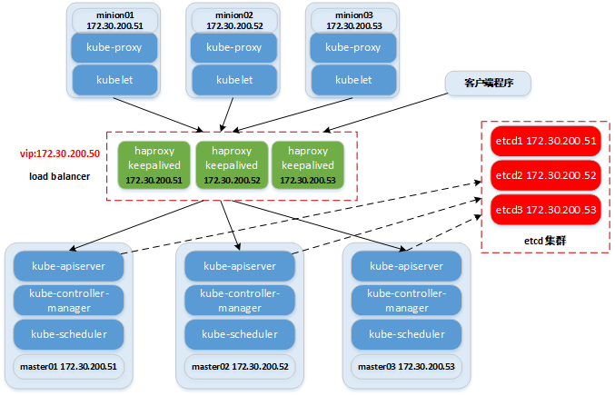

# 采用ansible部署高可用kubernetes集群

## 说明
本文档指导采用二进制包的方式快速部署高可用kubernetes集群。

参考：[高可用kubernetes集群](https://www.cnblogs.com/netonline/tag/kubernetes/)

## 组件版本
|组件|版本|备注|
|:---|:---|:---|
|centos|7.5|linux内核版本不低于3.10，本文档基于centos发行版本|
|haproxy|1.8.14|版本可选，本文档默认采用1.8.14版本|
|keepalived|2.0.10|版本可选，本文档默认采用2.0.10版本|
|docker|18.06.1.ce|版本可选，本文档默认采用18.06.1.ce版本|
|cfssl|R1.2|版本可选，本文档默认采用R.12版本|
|etcd|v3.3.10|版本可选，本文档默认采用v3.3.10版本|
|flannel|v0.10.0|版本可选，本文档默认采用v0.10.0版本|
|kubernetes|v1.11.4|版本可选，本文档默认采用v1.11.4版本|
|coredns|1.2.6|本文档默认采用1.2.6版本|
|dashboard|1.10.0|本文档默认采用1.10.0版本|
|heapster|v1.5.4|本文档默认采用v1.5.4版本|
|influxdb|v1.5.2|本文档默认采用v1.5.2版本|
|grafana|v5.0.4|本文档默认采用v5.0.4版本|
|nginx-ingress-controller|0.21.0|本文档默认采用0.21.0版本,以Daemonset的方式部署|

## 逻辑拓扑

1. 集群服务器数量建议：**3**；文档以172.30.200.51~53示例，172.30.200.50为vip；
2. 为减少服务器数量，采用all-in-one的方式，各角色服务融合部署；
3. 前端采用haproxy+keepalived做高可用；
4. k/v数据库采用etcd集群；
5. kubernetes-master角色组件：kube-apiserver，kube-controller-manager，kube-scheduler；
6. kubernetes-minion角色组件：kubelet，kube-proxy。

## 使用说明
### 环境准备
- 准备1台ansible-server（主控端）：
  - **与ansible-client可通信**；
  - **可访问互联网**（如果不可访问，可提前下载相关package上传到指定目录，可参考"~/k8s-ansible/download.sh")；
  - 理论上无硬件要求。
- 根据规划，准备若干台宿主机作为ansible-client（被控端），本文档宿主机数量为3：
  - 物理机或虚拟机；
  - **最小化安装，设置IP地址，启动ssh服务即可**；
  - **宿主机可访问互联网，否则需要通过其他方式初始化宿主机**（如采用虚拟机时，可通过镜像的方式统一初始化，初始化步骤参考"~/k8s-ansible/playbooks/roles/initenv/tasks/main.yaml"）；
  - 配置如下：

    |IP|CPU（cores）|Memory（GB）|Remark|
    |:---|:---|:---|:---|
    |172.30.200.51|4|4|根据实际部署情况酌情调整资源用量|
    |172.30.200.52|4|4|
    |172.30.200.53|4|4|

### 操作指南
以下操作若无特别说明，均在选定的ansible-server以root账户执行。
#### 1. 安装ansible-server
```shell
yum install ansible -y
```

#### 2. 设置ansible-server免密登陆ansible-client
ansible采用无代理的方式操作被控端，默认使用ssh协议对被控端进行管理，为避免下发指令时输入目标主机密码，采用签名证书的方式可ssh免密登陆目标主机。
  - ssh-keygen：生成秘钥(含公钥/私钥)时，使用默认设置，回车即可；
  - ssh-copy-id：分发公钥到所有目标主机时需要目标主机密码，注意for循环中的ansible-client格式。
  
    ```shell
    ssh-keygen -t rsa
    for i in "172.30.200.51" "172.30.200.52" "172.30.200.53"; do ssh-copy-id root@$i; done
    ```

#### 3. 拉取安装脚本
**重要：在运行账号的"~/"目录下拉取安装脚本**。
```shell
# 安装或升级git
yum install git -y

# 拉取安装脚本,注意脚本的保存目录
cd ~
git clone https://github.com/Netonline2016/k8s-ansible.git
```

#### 4. 下载安装包
为避免安装过程中，联网下载安装包超时或等待时间过长，提前下载相应package，并放置于对应路径下，此过程已整理为shell脚本，可直接运行。

如对package有版本要求，可在脚本中修改，请见"~/k8s-ansible/download.sh"脚本注释。
```shell
sh ~/k8s-ansible/download.sh
```

#### 5. 根据规划定义主机变量
涉及文件，修改请见相应文件注释：
  - ~/k8s-ansible/inventory/hosts
  - ~/k8s-ansible/inventory/group_vars/all

#### 6. 部署高可用kubernetes集群
采用ansible playbook方式运行自动化安装。
```shell
ansible-playbook -i ~/k8s-ansible/inventory/hosts ~/k8s-ansible/playbooks/k8s-ansible.yaml
```
